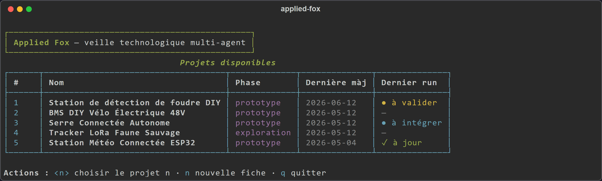
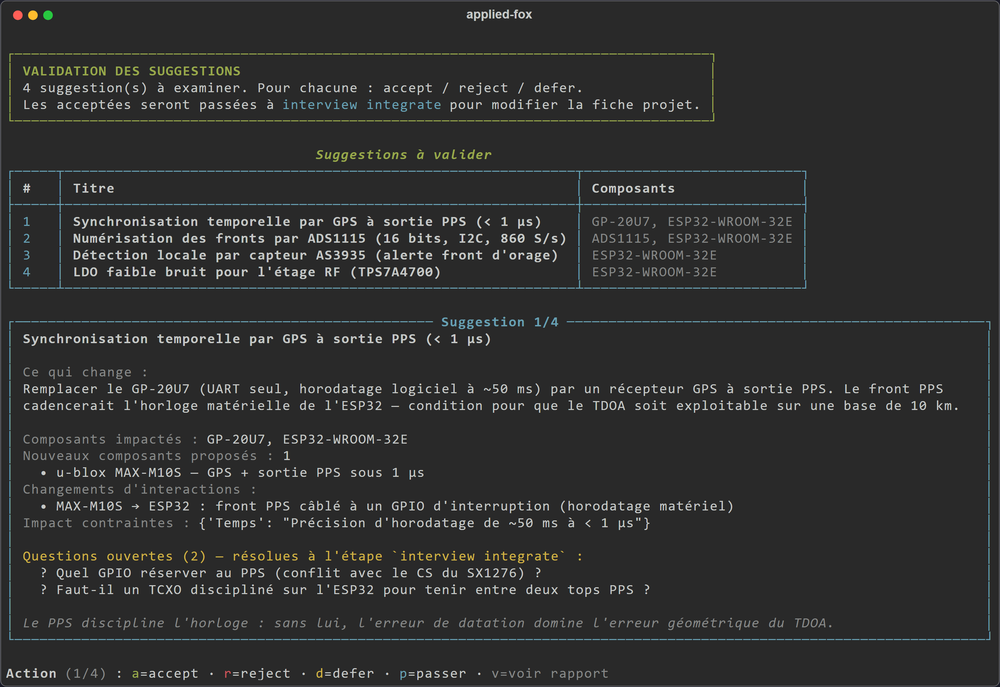
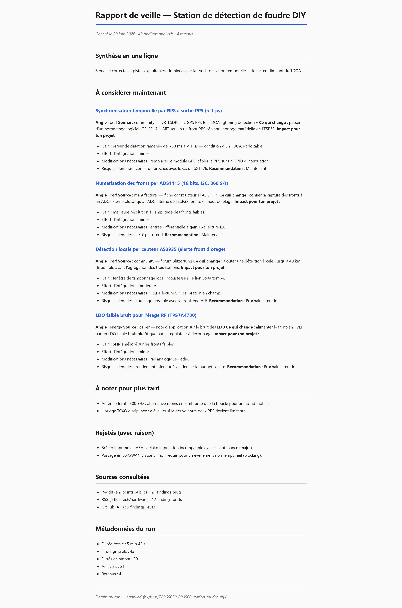
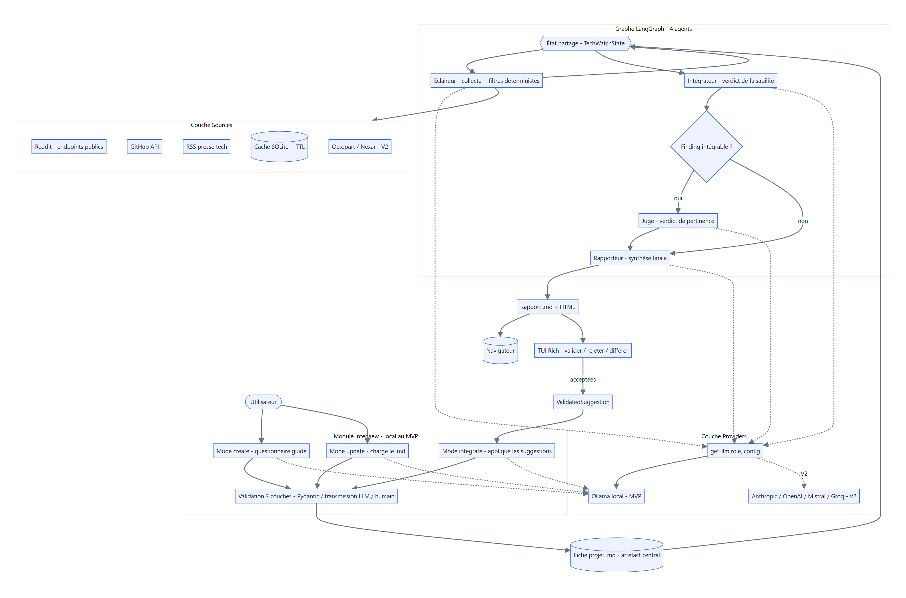

# Applied Fox

> *The R&D assistant that never leaves your machine, and never decides for you.*

**Status: MVP shipped. Milestones 1 through 8 + post-MVP v1.5 (deterministic Judge filters).** Current state and next steps: [`STATUS.md`](STATUS.md).

A local multi-agent technology watch system for engineering projects.
Everything runs locally via Ollama. No project data ever leaves your machine,
and no agent modifies a project file without explicit human validation.

> *(This README is in English for a wider reach. Core technical docs
> ([`docs/ARCHITECTURE.md`](docs/ARCHITECTURE.md) and
> [`docs/DECISIONS.md`](docs/DECISIONS.md)) are in English too. The rest of
> `docs/` (roadmap, evaluation reports, schemas) is in French for now, kept
> as the original technical archive.)*

---

## In 30 seconds

1. You describe your project once in a structured `.md` file (components,
   constraints, objectives, next deliverable).
2. You run `applied-fox`. A chain of 4 local agents collects, filters,
   evaluates and synthesizes information relevant to **your** project:
   a cheaper alternative component, an obsolescence alert, field feedback
   on your chipset, and so on.
3. You receive an HTML report with 3-8 prioritized suggestions (sometimes 0
   when the signal is weak this week; the report says so plainly).
   You validate the ones you care about. The tool updates your project file
   under your control.

No cloud, no SaaS, no subscription. Your technical plans stay yours.

## Quickstart (5 min)

```bash
git clone https://github.com/paul-des-brosses/applied-fox
cd applied-fox
bash setup.sh                  # venv + dependencies + Ollama check + model pull
source .venv/bin/activate      # Windows: .venv\Scripts\activate
pip install -e .

applied-fox                     # interactive menu — recommended entry point
```

The menu guides you:
1. Pick (or create) a project.
2. Choose "Run a new watch cycle" → progress bar, ~4-6 min cold,
   ~1-2 min with warm LLM cache (RTX 3070 8 GB).
3. Validate suggestions one by one (accept / reject / defer).
4. Integrate accepted ones: the tool proposes the project-file edits, you validate.

Install details: [`GETTING_STARTED.md`](GETTING_STARTED.md).
Step-by-step demo: [`DEMO.md`](DEMO.md).

## What it looks like

The multi-project menu — run a watch cycle, browse past runs, validate or
integrate the suggestions of the last run:



The validation loop is the heart of the human-in-the-loop design: every
suggestion is shown one at a time, with its impact, risks and open questions.
You accept, reject or defer it — nothing is written without your go-ahead.



At the end of a cycle the Reporter writes a self-contained HTML report: a
one-line synthesis, prioritized suggestions (gain, effort, risks), and an
audit trail of what was rejected and which sources were consulted.

<p align="center"></p>

> Screens are captured from the real UI, on a sample project (a DIY
> lightning-detection station). The report is an illustrative run, not a
> benchmark result.

## Why this project exists

AI tools for engineers suffer from two unacceptable defects: they send your
data to servers you do not control, and they tend to take over the project
on your behalf.

Applied Fox is built against both. The full philosophy, the project name,
and the long-term vision are in [`docs/VISION.md`](docs/VISION.md).

## Architecture at a glance

```
┌─────────────┐
│  project.md │ ← Interview module (create / update / skeleton / integrate)
│             │   3-layer validation (structural / transmission / human)
└──────┬──────┘
       │
       ▼
┌────────────────────────────────────────────────────────────────┐
│  LangGraph pipeline — 4 sequential agents                      │
│                                                                │
│  ┌──────────────┐  ┌────────────────┐  ┌──────┐  ┌────────────┐│
│  │ Scout        │→ │ Integrator     │→ │ Judge│→ │ Reporter   ││
│  │ Reddit + RSS │  │ feasibility    │  │ rank │  │ HTML       ││
│  │ + GitHub     │  │ assessment     │  │ +    │  │ report +   ││
│  │ 5x filtering │  │                │  │ ETA  │  │ suggestions││
│  └──────────────┘  └────────────────┘  └──────┘  └────────────┘│
└──────────────────────────┬─────────────────────────────────────┘
                           │
                           ▼
              ┌───────────────────────────┐
              │ Rich TUI validate         │ ← You validate each
              │ accept / reject / defer   │   suggestion manually
              └───────────┬───────────────┘
                          │
                          ▼
              ┌───────────────────────────┐
              │ Interviewer integrate     │ → modifies project.md
              │ 3-layer validation        │
              └───────────────────────────┘
```



**Why 4 agents and not one big prompt?**
Every agent has a strict Pydantic contract on output. If one fails, we know
exactly which and why. The Judge never sees findings rejected by the
Integrator, which avoids noise and saves LLM calls. This is the classic
"small focused prompt > big catch-all prompt" pattern.

Full details: [`docs/ARCHITECTURE.md`](docs/ARCHITECTURE.md).

## What works today (MVP — Milestone 8 + post-MVP v1.5)

- ✅ **Interview module**: 4 modes (create, skeleton, update, integrate),
  3-layer symmetric validation.
- ✅ **4-agent pipeline**: Scout → Integrator → Judge → Reporter,
  LangGraph, Pydantic contracts + retry, conditional branching.
- ✅ **3 active sources by default**: Reddit (public endpoints),
  RSS (5 tech/hardware feeds), GitHub (with README/topics enrichment
  for anti-hallucination).
- ✅ **Scout hybrid filtering**: 5 deterministic stages (score, freshness,
  alignment, dedup, incremental) + configurable cap + deterministic
  structuring.
- ✅ **Deterministic Judge filters (v1.5)**: 3 layers that enforce the
  prompt's rules 1bis/2bis (project anchoring, migration coherence,
  number-plating prevention). Saves ~70 % of Judge LLM calls via
  pre-LLM short-circuit. See [`docs/evaluations/post_mvp_filtres_juge_2026-05-13.md`](docs/evaluations/post_mvp_filtres_juge_2026-05-13.md) (FR).
- ✅ **Deterministic component classification**: regex extraction of
  references (BME280, SX1262...) + flag in-project vs new to prevent
  the Integrator from hallucinating about unknown components.
- ✅ **Disk LLM cache** (SQLite) with auto-invalidation by hash —
  ~10× savings on re-runs.
- ✅ **User validation loop**: Rich TUI to validate suggestions,
  resumable sequential integration.
- ✅ **Multi-project menu**: `applied-fox` (bare) opens a Rich TUI,
  real progress bar, browser HTML opening.
- ✅ **Hot-swap LLM per role**: each agent can run its own Ollama
  model. Default config tested on RTX 3070 8 GB:
  `mistral:7b` for mechanical tasks + `qwen3:8B` for the Judge.

## Differentiation

| Tool | Project awareness | Local | Human-in-the-loop | Proactive watch |
|---|---|---|---|---|
| **Applied Fox** | ✅ structured `.md` file | ✅ Ollama | ✅ per suggestion | ✅ 4 sequential agents |
| Google Alerts | ❌ flat keywords | ✅ | ❌ | ✅ (but massive noise) |
| ChatGPT / Claude | ❌ context lost | ❌ | ⚠️ post-hoc | ❌ |
| Domain newsletters | ❌ generalist | ✅ | ❌ | ✅ |
| Aider / Cursor | ⚠️ code only | ⚠️ partial | ✅ | ❌ |
| Devin / autonomous agents | ⚠️ goal-driven | ❌ | ❌ | ❌ |

Applied Fox occupies a precise niche: structured R&D watch that is local and under human control, for long-running projects where context knowledge is the main investment.

## Required models

Applied Fox uses two Ollama models, each adapted to its agent's complexity:

| Agent | Model | Why |
|---|---|---|
| Interviewer, Integrator, Reporter | `mistral:7b-instruct-q4_K_M` (4.4 GB) | Mechanical tasks (dialogue, integration, synthesis) |
| Judge | `qwen3:8B` (5.0 GB) | Meta-reasoning: distinguish truly relevant findings from those that only superficially resemble the project. The 7B model fails here. |

```bash
ollama pull mistral:7b-instruct-q4_K_M
ollama pull qwen3:8B
```

Total disk: ~10 GB.

The Interview module **always** runs on local 7B
(fundamental constraint, see [`docs/DECISIONS.md`](docs/DECISIONS.md)).

To adapt to other hardware (CPU only, larger GPU, etc.),
see [`docs/HARDWARE.md`](docs/HARDWARE.md) (FR).

Observed measurements (RTX 3070 8 GB, post-MVP v1.5):
- Full cold run, 1 project: ~4-6 min (Scout ~1 min + Integrator ~3 min + Judge ~5-10 s + Reporter ~1 s)
- Hot run with warm LLM cache: ~1-2 min per project
- First setup on a clean machine: ~20-30 min (model downloads included)

The Judge runs in ~10 s on ~20 integrable findings thanks to the
deterministic filters that short-circuit ~70 % of LLM calls in pre-processing.

## Documentation

- **Step-by-step demo** → [`DEMO.md`](DEMO.md)
- **Detailed install** → [`GETTING_STARTED.md`](GETTING_STARTED.md)
- **Hardware & models** → [`docs/HARDWARE.md`](docs/HARDWARE.md) (FR)
- **Vision and rationale** → [`docs/VISION.md`](docs/VISION.md)
- **Technical architecture** → [`docs/ARCHITECTURE.md`](docs/ARCHITECTURE.md)
- **Design decisions** → [`docs/DECISIONS.md`](docs/DECISIONS.md)
- **MVP roadmap** → [`docs/ROADMAP_MVP.md`](docs/ROADMAP_MVP.md) (FR)
- **Post-MVP backlog** → [`docs/BACKLOG.md`](docs/BACKLOG.md) (FR)
- **Project file format** → [`docs/MD_SCHEMA.md`](docs/MD_SCHEMA.md) (FR)
- **Configuration** → [`docs/CONFIG_SCHEMA.md`](docs/CONFIG_SCHEMA.md) (FR)
- **Glossary** → [`docs/GLOSSARY.md`](docs/GLOSSARY.md) (FR)
- **Per-milestone evaluations** → [`docs/evaluations/`](docs/evaluations/) (FR)

> Remaining French docs are kept as the original technical archive.
> Public-facing README, GETTING_STARTED, DEMO, VISION, plus ARCHITECTURE
> and DECISIONS, are in English.

## Philosophy: four non-negotiable constraints

1. **Local by default, everywhere.** The Interview module is local-only.
   The watch agents run locally. No silent network call, no telemetry,
   no server-side cache.
2. **Hot-swappable LLM.** Every call goes through `get_llm(role, config)`.
   Agents never import providers directly. Swapping models requires only a one-line config change.
3. **Hardware-adaptable.** One model per agent, sized for its task
   (hot-swap via config). See [`docs/HARDWARE.md`](docs/HARDWARE.md) (FR).
4. **Strict `.md` format.** The project file is validated by three
   symmetric layers. The user always remains the final arbiter: agents never
   modify the file without explicit human validation.

## Tech stack

- **Orchestration**: LangGraph + LangChain
- **LLM provider**: Ollama (local, hot-swappable)
- **Validation**: Pydantic v2
- **TUI**: Rich + Typer
- **Cache**: SQLite (LLM responses), requests-cache (HTTP sources)
- **Sources**: Reddit JSON endpoints, feedparser, PyGithub
- **Rendering**: mistune (Markdown → HTML)
- Python ≥ 3.11

## Author

Paul Des Brosses — R&D Engineer | Hardware / Software Integration | Creative Tech
GitHub: https://github.com/paul-des-brosses · LinkedIn: https://www.linkedin.com/in/paul-des-brosses/

This repository is part of a public portfolio at the intersection of hardware, software and applied AI. Other projects:

- [Forest of Senses](https://github.com/paul-des-brosses/forest-of-senses) — zero-instruction motor adaptation environment for post-stroke rehabilitation research
- [Bocage Digital Twin](https://github.com/paul-des-brosses/bocage-digital-twin) — instrumented digital twin of a Norman bocage countryside (Unity 6 WebGL)
- [Lightning TDOA Simulator](https://github.com/paul-des-brosses/lightning-tdoa-simulator) — simulation of a 3-station VLF lightning detection network

## License and status

M1 ESILV portfolio project (2025-2026). Code under MIT license.

Post-MVP evolution is tracked in [`docs/BACKLOG.md`](docs/BACKLOG.md) (FR),
including asyncio parallelization, opt-in cloud mode, multi-project batch, Octopart
integration for supply-chain, and daemon for permanent watch.
