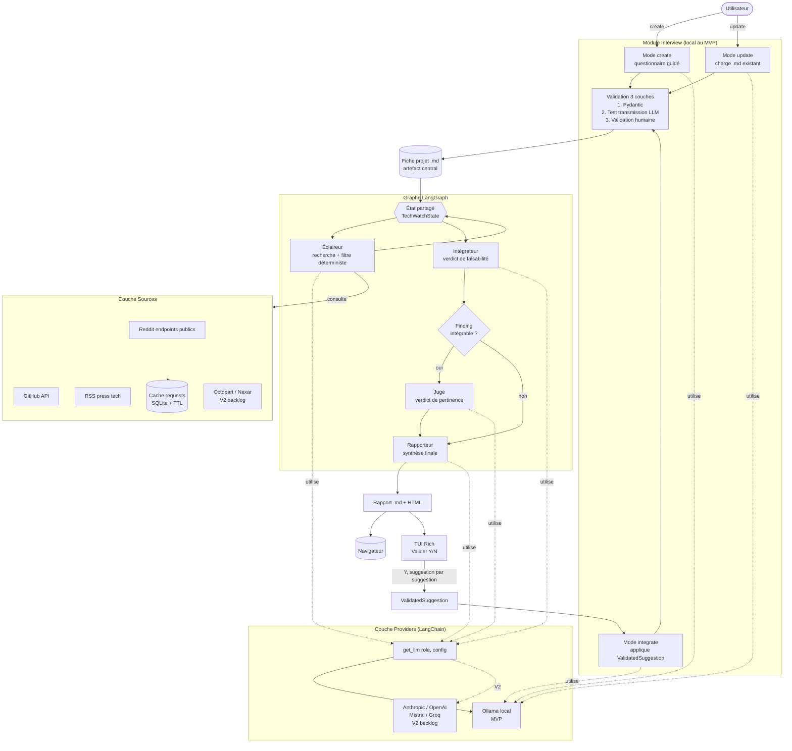
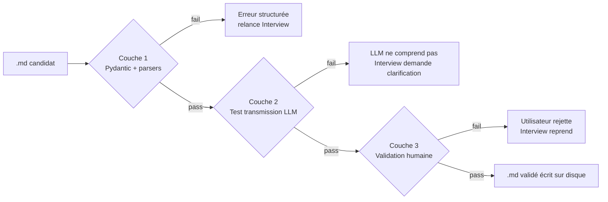

# ARCHITECTURE — Applied Fox

Ce document décrit l'architecture complète du système : couches, modules, schémas de données, flux, structure de fichiers. Il est cohérent avec [`DECISIONS.md`](DECISIONS.md) et [`ROADMAP_MVP.md`](ROADMAP_MVP.md). Les termes techniques sont vulgarisés dans [`GLOSSARY.md`](GLOSSARY.md).

---

## Vue d'ensemble

Applied Fox se structure en deux moitiés complémentaires :

1. **L'Interviewer** dialogue avec l'utilisateur pour produire (mode `create`) ou mettre à jour (mode `update` ou `integrate`) une **fiche projet** au format Markdown strict. Cette fiche est l'artefact central, partagé par tous les agents en aval. Elle est validée à trois couches.
2. **Le pipeline de veille** est un graphe LangGraph qui enchaîne quatre agents spécialisés (Éclaireur → Intégrateur → Juge → Rapporteur). Il prend la fiche projet en entrée et produit un rapport `.md`/HTML en sortie, accompagné d'objets `ValidatedSuggestion` qui sont ensuite réinjectés dans l'Interviewer pour modifier la fiche.

L'ensemble tourne en local. Le module Interview est exclusivement local — contrainte fondamentale. En V2, un mode `hybrid` permettra aux agents de veille de router vers un provider cloud sur choix explicite, l'Interview restant toujours local.

---

## Diagramme principal



---

## Séparation en trois couches

L'architecture sépare strictement trois préoccupations. Cette séparation est clé pour la maintenabilité, le hot-swap, et l'extensibilité.

### Couche Agents (`src/agents/`)

Code des cinq agents : `interviewer.py`, `eclaireur.py`, `integrateur.py`, `juge.py`, `rapporteur.py`. Chaque agent est un module Python qui :
- Reçoit un input typé (Pydantic).
- Construit son prompt système et utilisateur.
- Appelle un LLM via `get_llm(role, config)`.
- Parse la sortie en JSON Pydantic, avec retry en cas d'erreur.
- Renvoie un output typé.

Les agents ne savent pas quel modèle ni quel provider tourne derrière. C'est ce qui permet le hot-swap.

### Couche Providers (`src/llm/`)

Une seule fonction publique : `get_llm(role: str, config: dict) -> BaseChatModel`.

Au MVP, cette fonction route vers Ollama uniquement (modèle dépendant du `role` et du `profile` machine). En V2, elle pourra router vers Anthropic, OpenAI, Mistral, Groq selon la config.

**Principe** : un changement de modèle ou de provider se fait dans la config, pas dans le code des agents.

**Contrainte** : pour le rôle `interviewer`, `get_llm` retourne toujours un modèle local Ollama. Cette contrainte est fondamentale et non levée en V2 — l'Interview ne quitte pas la machine.

### Couche Sources (`src/sources/`)

Un fichier par source au MVP : `reddit.py`, `github.py`, `rss.py` (+ `common.py` pour le cache HTTP partagé). Octopart est en V2 backlog. Chaque module expose une interface unique :

```python
def search(query: SourceQuery) -> list[RawFinding]:
    ...
```

Avec un cache `requests-cache` partagé (TTL configuré par source, cf. [`CONFIG_SCHEMA.md`](CONFIG_SCHEMA.md)). Les modules sources sont indépendants : si Reddit est down, le système continue avec les autres.

---

## Description module par module

### Interviewer (`src/agents/interviewer.py`)

**Rôle** : seul module qui peut créer ou modifier un `.md` projet valide.

**Modes** :
- `create` : questionnaire guidé section par section. Pour chaque section, l'agent pose une série de questions, re-questionne si la réponse est floue (Option A pure du Bloc 7 — pas de mode conversationnel libre).
- `update` : charge un `.md` existant, propose des révisions ciblées (changement de phase, nouveaux composants, etc.).
- `integrate` : reçoit un objet `ValidatedSuggestion` après qu'une suggestion du rapport a été validée. Dialogue minimal pour clarifier les `open_questions`. Modifie la fiche en conséquence.

**Entrées** :
- Mode `create` : aucune entrée, démarre du vide.
- Mode `update` : chemin vers un `.md` existant.
- Mode `integrate` : chemin vers le `.md` + objet `ValidatedSuggestion`.

**Sortie** : un `.md` modifié, qui passe les trois couches de validation avant d'être écrit sur disque.

**LLM utilisé** : Ollama local, modèle 7B Q4. Le comportement est contrôlé par `get_llm("interviewer", config)` — toujours local, sans exception.

### Éclaireur (`src/agents/eclaireur.py`)

**Rôle** : interroger les sources, filtrer en amont, produire des `Finding` structurés.

**Entrées** : `.md` projet (parsé en `ProjectModel` Pydantic).

**Sortie** : `list[Finding]` (typiquement ~20 findings après filtrage).

**Étapes internes** :
1. Génère des requêtes ciblées dérivées des composants et objectifs actifs de la fiche.
2. Appelle les sources actives via la couche `src/sources/`.
3. Applique le **filtre déterministe en amont** : alignement composants/objectifs, fraîcheur, score communautaire minimum, déduplication par hash.
4. Pour chaque finding survivant, demande au LLM un résumé structuré au format `Finding`.
5. Filtre les findings déjà vus (mode incrémental, lecture de `~/.applied-fox/state/[projet]_seen.json`).

**Outils** : couche Sources, cache `requests-cache`.

### Intégrateur (`src/agents/integrateur.py`)

**Rôle** : pour chaque finding, dire s'il est intégrable et à quel coût.

**Entrées** : `.md` projet + un `Finding`.

**Sortie** : `IntegrationVerdict` (intégrable ou non, niveau d'effort, changements requis, risques).

**Étapes internes** :
1. Construit un prompt qui rappelle le projet et la stack actuelle.
2. Présente le finding et demande au LLM d'évaluer la faisabilité d'intégration.
3. Le LLM produit un raisonnement structuré, parsé en `IntegrationVerdict`.
4. Le rationale en clair est sauvegardé dans `02_integrateur_reasoning.md`.

**Outils** : aucun outil externe au MVP (pas de fetch datasheet, pas de recherche communautaire — features V2). Le module dispose des informations contenues dans le `Finding` et le `.md`.

### Juge (`src/agents/juge.py`)

**Rôle** : trancher la pertinence en croisant le verdict d'intégrabilité et le gain réel pour les objectifs actifs.

**Entrées** : `.md` projet + `Finding` + `IntegrationVerdict`.

**Sortie** : `JudgeVerdict` (pertinence, gain résumé, timing recommandé).

**Logique** :
- Si l'Intégrateur a renvoyé `integrable=False`, le Juge n'est pas appelé (court-circuit dans le graphe LangGraph) — le finding va directement vers la section "Rejetés" du rapport.
- Sinon, le Juge évalue le gain net (intérêt - effort - risques) à la lumière des objectifs actifs et du timing du projet (phase, prochain rendu).
- Aucun outil externe.

### Rapporteur (`src/agents/rapporteur.py`)

**Rôle** : produire le rapport `.md` final + les objets `ValidatedSuggestion` exploitables.

**Entrées** : `list[Finding]` + `dict[finding_id, IntegrationVerdict]` + `dict[finding_id, JudgeVerdict]`.

**Sorties** :
- Un `final_report.md` (rendu HTML pour le navigateur).
- Une `list[ValidatedSuggestion]` pour chaque finding retenu (utilisée si l'utilisateur valide une suggestion).

**Format du rapport** : voir section dédiée plus bas.

---

## Schémas Pydantic principaux

### Finding

```python
from typing import Literal
from pydantic import BaseModel

class Finding(BaseModel):
    id: str  # hash stable
    title: str
    component_concerned: str
    angle: Literal["perf", "price", "supply", "energy", "regulation", "obsolescence"]
    description: str
    source_url: str
    source_type: Literal["manufacturer", "community", "marketplace", "paper", "news"]
    raw_data: dict  # specs brutes optionnelles
```

### IntegrationVerdict

```python
class IntegrationVerdict(BaseModel):
    finding_id: str
    integrable: bool
    effort_level: Literal["trivial", "minor", "moderate", "major", "blocking"]
    required_changes: list[str]
    risks: list[str]
    uncertainties: list[str]
    confidence: Literal["high", "medium", "low"]
    rationale: str  # extrait pour 02_integrateur_reasoning.md
```

### JudgeVerdict

```python
class JudgeVerdict(BaseModel):
    finding_id: str
    relevance: Literal["high", "medium", "low", "reject"]
    real_gain_summary: str
    timing_recommendation: Literal["now", "next_iteration", "noted_for_future", "reject"]
    rationale: str  # extrait pour 03_juge_reasoning.md
```

### ValidatedSuggestion

```python
class ValidatedSuggestion(BaseModel):
    title: str
    changes_summary: str
    components_affected: list[str]
    new_components: list[dict]
    interactions_changes: list[str]
    constraints_impact: dict
    integration_notes: str
    open_questions: list[str]  # ce que l'Interviewer doit clarifier en mode integrate
```

### TechWatchState (état partagé LangGraph)

```python
from typing import TypedDict

class TechWatchState(TypedDict):
    project_md: str
    findings: list[Finding]
    integration_verdicts: dict  # finding_id -> IntegrationVerdict
    judge_verdicts: dict  # finding_id -> JudgeVerdict
    final_report: str
    errors: list[str]
```

L'état est mis à jour à chaque nœud du graphe. LangGraph gère la persistance et le branchement conditionnel (si un `Finding` n'est pas intégrable, on saute le Juge pour ce finding).

---

## Flux de données complet

### 1. Lancement et chargement

L'utilisateur lance `applied-fox run --project chemin/vers/projet.md`. La CLI :
1. Charge la config globale `~/.applied-fox/config.yaml`.
2. Charge le `.md` projet, le parse en `ProjectModel`, valide niveau 1+2 (sections + structure).
3. Charge le state incrémental `~/.applied-fox/state/[projet]_seen.json` si existant.
4. Initialise l'état `TechWatchState`.

### 2. Étape Éclaireur

1. Génère des requêtes pour chaque source active.
2. Interroge les sources, en passant par le cache `requests-cache` (TTL différenciés).
3. Applique le filtre déterministe : composants/objectifs alignés, fraîcheur, scores, déduplication par hash, exclusion des findings déjà vus.
4. Pour chaque finding survivant, appelle le LLM pour produire un `Finding` structuré (JSON Pydantic, retry sur erreur).
5. Sauvegarde `01_eclaireur_findings.json` et `01_eclaireur_sources.json` (ce dernier contient aussi les findings filtrés en amont, pour audit).

### 3. Étape Intégrateur (parallélisable par finding)

Pour chaque `Finding` :
1. Appelle le LLM avec `.md` + finding.
2. Parse en `IntegrationVerdict`.
3. Sauvegarde `02_integrateur_verdicts.json` (un fichier global) et appende le rationale au `02_integrateur_reasoning.md`.

### 4. Branchement conditionnel

Si `IntegrationVerdict.integrable == False` : le finding est marqué pour la section "Rejetés", on saute le Juge.

### 5. Étape Juge (parallélisable par finding intégrable)

Pour chaque finding intégrable :
1. Appelle le LLM avec `.md` + finding + verdict d'intégration.
2. Parse en `JudgeVerdict`.
3. Sauvegarde `03_juge_verdicts.json` et `03_juge_reasoning.md`.

### 6. Étape Rapporteur

1. Croise les `JudgeVerdict` et trie par `relevance` puis `timing_recommendation`.
2. Génère le rapport `04_final_report.md`.
3. Convertit en HTML via `markdown2` ou `mistune` + template simple.
4. Produit la `list[ValidatedSuggestion]` pour les findings retenus (`relevance != reject`).

### 7. Présentation et validation

1. Ouverture automatique du HTML dans le navigateur par défaut.
2. TUI Rich prompte : `Valider rapport (Y/N)`.
3. Si `Y` : itère sur chaque suggestion une par une, lance l'Interviewer en mode `integrate` avec la `ValidatedSuggestion`.
4. L'Interviewer dialogue pour clarifier les `open_questions`, modifie le `.md`.
5. Le `.md` modifié repasse les trois couches de validation.
6. Si validé, le `.md` est sauvegardé, une ligne est appendée à la section "Changements".
7. Sauvegarde `05_validated_suggestions.json` et le diff dans `06_md_diffs/`.

### 8. Fin de run

Mise à jour de `~/.applied-fox/state/[projet]_seen.json` (hashs des findings présentés ce run).
Sauvegarde des métadonnées (durée, tokens, erreurs) dans `metadata.json`.

---

## Système de validation à 3 couches

Appliqué symétriquement à la création initiale du `.md` ET à toute modification ultérieure (mode `integrate`).



**Couche 1 — Validation déterministe** (`src/validation/structural.py`) :
- Niveau 1 : sections obligatoires présentes.
- Niveau 2 : structure interne (colonnes des tables, valeurs énumérées, formats de date).
- Niveau 3 : cohérence sémantique interne (composants référencés dans Interactions existent dans la table Composants, dates cohérentes avec la phase).

**Couche 2 — Test de transmission par LLM** (`src/validation/transmission.py`) :
- Un appel LLM dédié, *sans* contexte de la conversation.
- Prompt : "Voici un fichier .md décrivant un projet. Résume en clair ce que tu comprends du projet."
- Le résumé est confronté à des questions de contrôle (présence des composants clés, des objectifs, etc.).
- Si le résumé montre que le `.md` n'est pas autonome, on retourne en Interview.

**Couche 3 — Validation humaine** (`src/validation/human.py`) :
- TUI Rich affiche un récap structuré du `.md`.
- L'utilisateur valide, demande modification, ou annule.

---

## Structure de fichiers `~/.applied-fox/`

```
~/.applied-fox/
├── projects/                         # les .md des projets de l'utilisateur
│   ├── esp32_weather_station.md
│   ├── forest_of_senses.md
│   └── ...
├── runs/                             # artefacts complets de chaque run
│   └── 20260601-1430_esp32_weather_station/
│       └── (cf. structure ci-dessous)
├── cache/
│   └── requests.sqlite               # cache requests-cache (TTL par source)
├── state/
│   ├── esp32_weather_station_seen.json    # hashs des findings déjà vus
│   ├── esp32_weather_station_last_report.md
│   └── ...
└── config.yaml                       # config globale
```

## Structure d'un dossier de run

```
~/.applied-fox/runs/20260601-1430_esp32_weather_station/
├── 00_input.md                       # le .md projet utilisé en entrée
├── 01_eclaireur_findings.json        # findings bruts retenus après filtre
├── 01_eclaireur_sources.json         # sources consultées + findings filtrés en amont
├── 02_integrateur_verdicts.json      # tous les IntegrationVerdict
├── 02_integrateur_reasoning.md       # rationale en clair par finding
├── 03_juge_verdicts.json             # tous les JudgeVerdict
├── 03_juge_reasoning.md              # rationale en clair par finding
├── 04_final_report.md                # rapport visible utilisateur (Markdown)
├── 04_final_report.html              # version HTML rendue
├── 05_validated_suggestions.json     # suggestions validées par l'utilisateur ce run
├── 06_md_diffs/                      # diffs des modifications du .md
│   ├── 01_initial.diff
│   ├── 02_suggestion_BME680.diff
│   └── ...
└── metadata.json                     # durées, tokens consommés, erreurs, version modèles
```

Cette structure rend chaque run **auditable bout en bout**. Un dev externe (ou l'utilisateur lui-même six mois plus tard) peut comprendre exactement pourquoi telle suggestion a été produite.

---

## Format du rapport final

Le rapport est généré par le Rapporteur en Markdown, puis converti en HTML pour le navigateur.

```markdown
# Rapport de veille — [Nom du projet]
*Généré le [date], [N] findings analysés, [M] retenus*

## Synthèse en une ligne
[Une phrase qui résume]

## À considérer maintenant
[Findings alignés avec objectifs actifs et gain réel quantifiable]

### [Titre du finding]
**Angle** : [perf / price / supply / energy / regulation / obsolescence]
**Source** : [...]
**Ce qui change** : [2-3 phrases]
**Impact pour ton projet** :
- Gain : [...]
- Effort d'intégration : [trivial / minor / moderate / major]
- Modifications nécessaires : [...]
- Risques identifiés : [...]
**Recommandation** : [Maintenant / Prochaine itération / À noter]

## À noter pour plus tard
[Format condensé : titre + une ligne]

## Rejetés (avec raison)
[Format très condensé : titre + raison du rejet]

## Sources consultées
[Liste avec nombre de findings bruts par source]

## Métadonnées du run
- Durée totale : [...]
- Findings bruts : [...]
- Filtrés en amont : [...]
- Analysés : [...]
- Retenus : [...]

---
*Détails du run : [chemin vers le dossier runs/...]*
```

**Pas de section feedback au MVP** (cf. [DECISIONS.md §12](DECISIONS.md)).

---

## Configuration et profile machine

La config globale `~/.applied-fox/config.yaml` définit :
- Le **profile machine** (`small` / `medium` / `large`).
- Les **modèles** par rôle (interviewer local 7B au MVP, autres rôles selon profile).
- Les **sources actives** et leurs paramètres (clés via variables d'environnement, TTL cache, filtres).
- Le **mode provider** (`local` au MVP).

Spec complète : [`CONFIG_SCHEMA.md`](CONFIG_SCHEMA.md).

---

## Hot-swap : test de bascule

Pour valider l'abstraction `get_llm()`, un test explicite est inscrit dans la roadmap (Jalon 5) :
> Bascule du modèle Ollama 7B vers 14B (changement de profile machine) sans modification de code, en moins de 5 minutes.

Ce test garantit que la couche d'abstraction est réelle, pas cosmétique.

---

## Observabilité (optionnelle, dev uniquement)

LangFuse self-hosted (Docker) recommandé pour développer. Permet de visualiser : prompts envoyés, latences, tokens consommés, erreurs de parsing, retries.

Alternative : LangSmith hébergé pour usage perso (gratuit jusqu'à un certain volume).

L'utilisateur final n'a besoin ni de l'un ni de l'autre — c'est strictement un outil de dev. Aucune dépendance dure dans le code.
