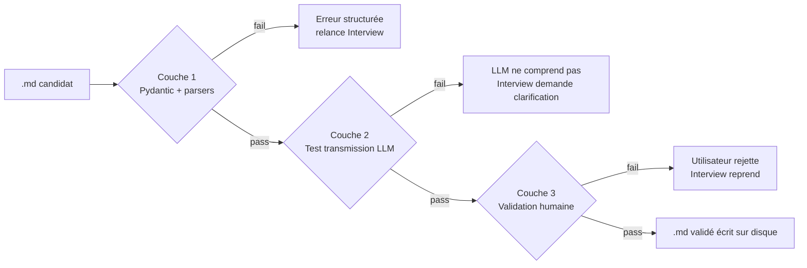

# ARCHITECTURE — Applied Fox

This document describes the complete system architecture: layers, modules, data schemas, flows, file structure. It is consistent with [`DECISIONS.md`](DECISIONS.md) and [`ROADMAP_MVP.md`](ROADMAP_MVP.md). Technical terms are explained in plain language in [`GLOSSARY.md`](GLOSSARY.md).

---

## Overview

Applied Fox is structured in two complementary halves:

1. **The Interviewer** dialogues with the user to produce (`create` mode) or update (`update` or `integrate` mode) a **project sheet** in strict Markdown format. This sheet is the central artifact, shared by all downstream agents. It is validated through three layers.
2. **The tech-watch pipeline** is a LangGraph graph chaining four specialized agents (Éclaireur → Intégrateur → Juge → Rapporteur — Scout / Integrator / Judge / Reporter). It takes the project sheet as input and produces a `.md`/HTML report as output, along with `ValidatedSuggestion` objects that are then fed back into the Interviewer to modify the sheet.

Everything runs locally. The Interview module is exclusively local — a fundamental constraint. In V2, a `hybrid` mode will allow the tech-watch agents to route to a cloud provider by explicit choice, with the Interview always remaining local.

---

## Main diagram


*Rendered from the Mermaid source above (`docs/media/architecture.png`).*

---

## Separation into three layers

The architecture strictly separates three concerns. This separation is key for maintainability, hot-swap, and extensibility.

### Agents layer (`src/agents/`)

Code for the five agents: `interviewer.py`, `eclaireur.py`, `integrateur.py`, `juge.py`, `rapporteur.py`. Each agent is a Python module that:
- Receives a typed input (Pydantic).
- Builds its system and user prompts.
- Calls an LLM via `get_llm(role, config)`.
- Parses the output into Pydantic JSON, with retry on error.
- Returns a typed output.

Agents do not know which model or which provider runs behind them. This is what enables hot-swap.

### Providers layer (`src/llm/`)

A single public function: `get_llm(role: str, config: dict) -> BaseChatModel`.

In the MVP, this function routes to Ollama only (model depending on the `role` and the machine `profile`). In V2, it will be able to route to Anthropic, OpenAI, Mistral, Groq depending on the config.

**Principle**: a model or provider change happens in the config, not in the agents' code.

**Constraint**: for the `interviewer` role, `get_llm` always returns a local Ollama model. This constraint is fundamental and is not lifted in V2 — the Interview never leaves the machine.

### Sources layer (`src/sources/`)

One file per source in the MVP: `reddit.py`, `github.py`, `rss.py` (+ `common.py` for the shared HTTP cache). Octopart is in the V2 backlog. Each module exposes a single interface:

```python
def search(query: SourceQuery) -> list[RawFinding]:
    ...
```

With a shared `requests-cache` (TTL configured per source, see [`CONFIG_SCHEMA.md`](CONFIG_SCHEMA.md)). Source modules are independent: if Reddit is down, the system continues with the others.

---

## Module-by-module description

### Interviewer (`src/agents/interviewer.py`)

**Role**: the only module that can create or modify a valid project `.md`.

**Modes**:
- `create`: guided questionnaire, section by section. For each section, the agent asks a series of questions, and asks again if the answer is vague (pure Option A from Block 7 — no free-form conversational mode).
- `update`: loads an existing `.md`, proposes targeted revisions (phase change, new components, etc.).
- `integrate`: receives a `ValidatedSuggestion` object after a suggestion from the report has been validated. Minimal dialogue to clarify the `open_questions`. Modifies the sheet accordingly.

**Inputs**:
- `create` mode: no input, starts from scratch.
- `update` mode: path to an existing `.md`.
- `integrate` mode: path to the `.md` + `ValidatedSuggestion` object.

**Output**: a modified `.md`, which passes the three validation layers before being written to disk.

**LLM used**: local Ollama, 7B Q4 model. Behavior is controlled by `get_llm("interviewer", config)` — always local, without exception.

### Éclaireur (`src/agents/eclaireur.py`)

**Role**: query the sources, filter upstream, produce structured `Finding` objects.

**Inputs**: project `.md` (parsed into a Pydantic `ProjectModel`).

**Output**: `list[Finding]` (typically ~20 findings after filtering).

**Internal steps**:
1. Generates targeted queries derived from the sheet's active components and objectives.
2. Calls the active sources via the `src/sources/` layer.
3. Applies the **deterministic upstream filter**: component/objective alignment, freshness, minimum community score, hash-based deduplication.
4. For each surviving finding, asks the LLM for a structured summary in the `Finding` format.
5. Filters out findings already seen (incremental mode, reading `~/.applied-fox/state/[projet]_seen.json`).

**Tools**: Sources layer, `requests-cache`.

### Intégrateur (`src/agents/integrateur.py`)

**Role**: for each finding, state whether it can be integrated and at what cost.

**Inputs**: project `.md` + a `Finding`.

**Output**: `IntegrationVerdict` (integrable or not, effort level, required changes, risks).

**Internal steps**:
1. Builds a prompt that recalls the project and the current stack.
2. Presents the finding and asks the LLM to assess integration feasibility.
3. The LLM produces structured reasoning, parsed into an `IntegrationVerdict`.
4. The plain-text rationale is saved to `02_integrateur_reasoning.md`.

**Tools**: no external tools in the MVP (no datasheet fetching, no community search — V2 features). The module works with the information contained in the `Finding` and the `.md`.

### Juge (`src/agents/juge.py`)

**Role**: decide on relevance by cross-referencing the integrability verdict and the real gain for the active objectives.

**Inputs**: project `.md` + `Finding` + `IntegrationVerdict`.

**Output**: `JudgeVerdict` (relevance, summarized gain, recommended timing).

**Logic**:
- If the Intégrateur returned `integrable=False`, the Juge is not called (short-circuit in the LangGraph graph) — the finding goes directly to the "Rejected" section of the report.
- Otherwise, the Juge evaluates the net gain (interest - effort - risks) in light of the active objectives and the project timing (phase, next deliverable).
- No external tools.

### Rapporteur (`src/agents/rapporteur.py`)

**Role**: produce the final `.md` report + the actionable `ValidatedSuggestion` objects.

**Inputs**: `list[Finding]` + `dict[finding_id, IntegrationVerdict]` + `dict[finding_id, JudgeVerdict]`.

**Outputs**:
- A `final_report.md` (rendered as HTML for the browser).
- A `list[ValidatedSuggestion]` for each retained finding (used if the user validates a suggestion).

**Report format**: see the dedicated section below.

---

## Main Pydantic schemas

### Finding

```python
from typing import Literal
from pydantic import BaseModel

class Finding(BaseModel):
    id: str  # hash stable
    title: str
    component_concerned: str
    angle: Literal["perf", "price", "supply", "energy", "regulation", "obsolescence"]
    description: str
    source_url: str
    source_type: Literal["manufacturer", "community", "marketplace", "paper", "news"]
    raw_data: dict  # specs brutes optionnelles
```

### IntegrationVerdict

```python
class IntegrationVerdict(BaseModel):
    finding_id: str
    integrable: bool
    effort_level: Literal["trivial", "minor", "moderate", "major", "blocking"]
    required_changes: list[str]
    risks: list[str]
    uncertainties: list[str]
    confidence: Literal["high", "medium", "low"]
    rationale: str  # extrait pour 02_integrateur_reasoning.md
```

### JudgeVerdict

```python
class JudgeVerdict(BaseModel):
    finding_id: str
    relevance: Literal["high", "medium", "low", "reject"]
    real_gain_summary: str
    timing_recommendation: Literal["now", "next_iteration", "noted_for_future", "reject"]
    rationale: str  # extrait pour 03_juge_reasoning.md
```

### ValidatedSuggestion

```python
class ValidatedSuggestion(BaseModel):
    title: str
    changes_summary: str
    components_affected: list[str]
    new_components: list[dict]
    interactions_changes: list[str]
    constraints_impact: dict
    integration_notes: str
    open_questions: list[str]  # ce que l'Interviewer doit clarifier en mode integrate
```

### TechWatchState (LangGraph shared state)

```python
from typing import TypedDict

class TechWatchState(TypedDict):
    project_md: str
    findings: list[Finding]
    integration_verdicts: dict  # finding_id -> IntegrationVerdict
    judge_verdicts: dict  # finding_id -> JudgeVerdict
    final_report: str
    errors: list[str]
```

The state is updated at each node of the graph. LangGraph handles persistence and conditional branching (if a `Finding` is not integrable, the Juge is skipped for that finding).

---

## Complete data flow

### 1. Launch and loading

The user runs `applied-fox run --project chemin/vers/projet.md`. The CLI:
1. Loads the global config `~/.applied-fox/config.yaml`.
2. Loads the project `.md`, parses it into a `ProjectModel`, validates levels 1+2 (sections + structure).
3. Loads the incremental state `~/.applied-fox/state/[projet]_seen.json` if it exists.
4. Initializes the `TechWatchState` state.

### 2. Éclaireur step

1. Generates queries for each active source.
2. Queries the sources, going through the `requests-cache` (per-source TTLs).
3. Applies the deterministic filter: aligned components/objectives, freshness, scores, hash-based deduplication, exclusion of findings already seen.
4. For each surviving finding, calls the LLM to produce a structured `Finding` (Pydantic JSON, retry on error).
5. Saves `01_eclaireur_findings.json` and `01_eclaireur_sources.json` (the latter also contains the findings filtered upstream, for audit purposes).

### 3. Intégrateur step (parallelizable per finding)

For each `Finding`:
1. Calls the LLM with the `.md` + finding.
2. Parses into an `IntegrationVerdict`.
3. Saves `02_integrateur_verdicts.json` (one global file) and appends the rationale to `02_integrateur_reasoning.md`.

### 4. Conditional branching

If `IntegrationVerdict.integrable == False`: the finding is marked for the "Rejected" section, and the Juge is skipped.

### 5. Juge step (parallelizable per integrable finding)

For each integrable finding:
1. Calls the LLM with the `.md` + finding + integration verdict.
2. Parses into a `JudgeVerdict`.
3. Saves `03_juge_verdicts.json` and `03_juge_reasoning.md`.

### 6. Rapporteur step

1. Cross-references the `JudgeVerdict` objects and sorts by `relevance` then `timing_recommendation`.
2. Generates the `04_final_report.md` report.
3. Converts to HTML via `markdown2` or `mistune` + a simple template.
4. Produces the `list[ValidatedSuggestion]` for the retained findings (`relevance != reject`).

### 7. Presentation and validation

1. Automatic opening of the HTML in the default browser.
2. Rich TUI prompts: `Valider rapport (Y/N)`.
3. If `Y`: iterates over each suggestion one by one, launches the Interviewer in `integrate` mode with the `ValidatedSuggestion`.
4. The Interviewer dialogues to clarify the `open_questions`, modifies the `.md`.
5. The modified `.md` goes through the three validation layers again.
6. If validated, the `.md` is saved, and a line is appended to the "Changes" section.
7. Saves `05_validated_suggestions.json` and the diff in `06_md_diffs/`.

### 8. End of run

Update of `~/.applied-fox/state/[projet]_seen.json` (hashes of the findings presented this run).
Saving of the metadata (duration, tokens, errors) in `metadata.json`.

---

## 3-layer validation system

Applied symmetrically to the initial creation of the `.md` AND to any subsequent modification (`integrate` mode).



**Layer 1 — Deterministic validation** (`src/validation/structural.py`):
- Level 1: mandatory sections present.
- Level 2: internal structure (table columns, enumerated values, date formats).
- Level 3: internal semantic consistency (components referenced in Interactions exist in the Components table, dates consistent with the phase).

**Layer 2 — LLM transmission test** (`src/validation/transmission.py`):
- A dedicated LLM call, *without* the conversation context.
- Prompt: "Here is a .md file describing a project. Summarize in plain language what you understand about the project."
- The summary is checked against control questions (presence of the key components, objectives, etc.).
- If the summary shows that the `.md` is not self-contained, the process returns to the Interview.

**Layer 3 — Human validation** (`src/validation/human.py`):
- Rich TUI displays a structured recap of the `.md`.
- The user validates, requests a modification, or cancels.

---

## File structure of `~/.applied-fox/`

```
~/.applied-fox/
├── projects/                         # les .md des projets de l'utilisateur
│   ├── esp32_weather_station.md
│   ├── forest_of_senses.md
│   └── ...
├── runs/                             # artefacts complets de chaque run
│   └── 20260601-1430_esp32_weather_station/
│       └── (cf. structure ci-dessous)
├── cache/
│   └── requests.sqlite               # cache requests-cache (TTL par source)
├── state/
│   ├── esp32_weather_station_seen.json    # hashs des findings déjà vus
│   ├── esp32_weather_station_last_report.md
│   └── ...
└── config.yaml                       # config globale
```

## Structure of a run folder

```
~/.applied-fox/runs/20260601-1430_esp32_weather_station/
├── 00_input.md                       # le .md projet utilisé en entrée
├── 01_eclaireur_findings.json        # findings bruts retenus après filtre
├── 01_eclaireur_sources.json         # sources consultées + findings filtrés en amont
├── 02_integrateur_verdicts.json      # tous les IntegrationVerdict
├── 02_integrateur_reasoning.md       # rationale en clair par finding
├── 03_juge_verdicts.json             # tous les JudgeVerdict
├── 03_juge_reasoning.md              # rationale en clair par finding
├── 04_final_report.md                # rapport visible utilisateur (Markdown)
├── 04_final_report.html              # version HTML rendue
├── 05_validated_suggestions.json     # suggestions validées par l'utilisateur ce run
├── 06_md_diffs/                      # diffs des modifications du .md
│   ├── 01_initial.diff
│   ├── 02_suggestion_BME680.diff
│   └── ...
└── metadata.json                     # durées, tokens consommés, erreurs, version modèles
```

This structure makes every run **auditable end to end**. An external dev (or the user themselves six months later) can understand exactly why a given suggestion was produced.

---

## Final report format

The report is generated by the Rapporteur in Markdown, then converted to HTML for the browser.

```markdown
# Rapport de veille — [Nom du projet]
*Généré le [date], [N] findings analysés, [M] retenus*

## Synthèse en une ligne
[Une phrase qui résume]

## À considérer maintenant
[Findings alignés avec objectifs actifs et gain réel quantifiable]

### [Titre du finding]
**Angle** : [perf / price / supply / energy / regulation / obsolescence]
**Source** : [...]
**Ce qui change** : [2-3 phrases]
**Impact pour ton projet** :
- Gain : [...]
- Effort d'intégration : [trivial / minor / moderate / major]
- Modifications nécessaires : [...]
- Risques identifiés : [...]
**Recommandation** : [Maintenant / Prochaine itération / À noter]

## À noter pour plus tard
[Format condensé : titre + une ligne]

## Rejetés (avec raison)
[Format très condensé : titre + raison du rejet]

## Sources consultées
[Liste avec nombre de findings bruts par source]

## Métadonnées du run
- Durée totale : [...]
- Findings bruts : [...]
- Filtrés en amont : [...]
- Analysés : [...]
- Retenus : [...]

---
*Détails du run : [chemin vers le dossier runs/...]*
```

**No feedback section in the MVP** (see [DECISIONS.md §12](DECISIONS.md)).

---

## Configuration and machine profile

The global config `~/.applied-fox/config.yaml` defines:
- The **machine profile** (`small` / `medium` / `large`).
- The **models** per role (local 7B interviewer in the MVP, other roles depending on the profile).
- The **active sources** and their parameters (keys via environment variables, cache TTL, filters).
- The **provider mode** (`local` in the MVP).

Full spec: [`CONFIG_SCHEMA.md`](CONFIG_SCHEMA.md).

---

## Hot-swap: switch test

To validate the `get_llm()` abstraction, an explicit test is written into the roadmap (Milestone 5):
> Switch from the Ollama 7B model to 14B (machine profile change) without any code modification, in under 5 minutes.

This test guarantees that the abstraction layer is real, not cosmetic.

---

## Observability (optional, dev only)

Self-hosted LangFuse (Docker) recommended for development. Allows visualizing: prompts sent, latencies, tokens consumed, parsing errors, retries.

Alternative: hosted LangSmith for personal use (free up to a certain volume).

The end user needs neither — it is strictly a dev tool. No hard dependency in the code.
